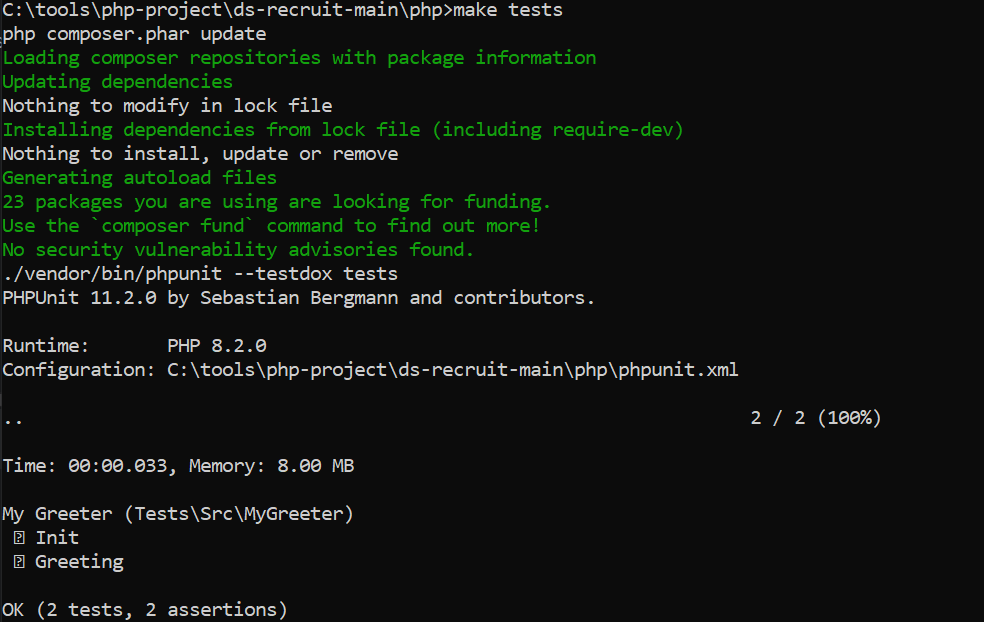

# Ds Recruit 

### Introduce Resolve Project Code Documentation
The Resolve Project Code contains php and java resolve code template

* [ds-rescruit-php](https://github.com/talk-ming/ds-recruit/php)
* [ds-rescruit-java](https://github.com/talk-ming/ds-recruit/java)


### ds-rescruit-php
The following answers :
* Containers MakeFileScript script file basic role
  <br/>
```
1.Install dependencies and updates
  make composer-update
  
2.Run test
  make tests
  
3.Starting the development environment
  make dev-up
  
4.Run tests in development environment
  make dev-tests
```


* Containers MakeFile related docker-compose.yml need modify
```angular2html
  It's best to use the repository address for the image to make sure latest feature.
  image: https://github.com/talk-ming/recruit/php
```

* MyGreeterTest Class need modify
  * 1.Adding namespace
  * 2.Modify method hump naming
  * 3.Use Mock object to test


### ds-rescruit-java
* Similar to php, the method is validated using unit test.