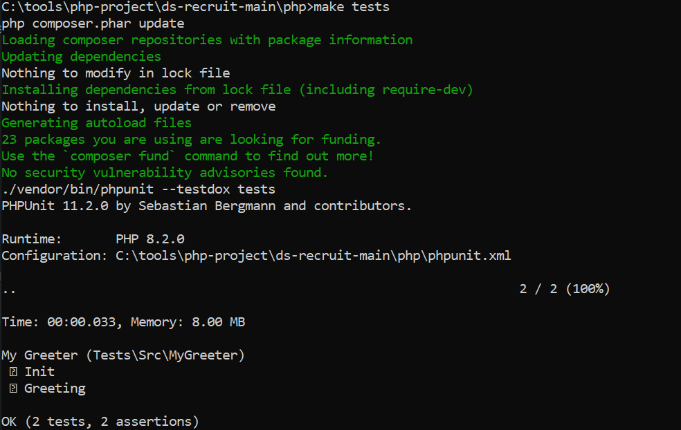

# Ds Recruit 

### Introduce Resolve Project Code Documentation
这个项目可以用很多我会的语言去实现，可以用PHP、Java、Js、Node.js
这里我就用PHP、Java去实现

* [ds-rescruit-php](https://github.com/talk-ming/ds-recruit/tree/master/php)
* [ds-rescruit-java](https://github.com/talk-ming/ds-recruit/tree/master/java)


### ds-rescruit-php
The following answers :
* 容器环境MakeFile脚本文件基本作用
  <br/>
```
1.安装依赖和更新
  make composer-update
  
2.运行单元测试
  make tests
  
3.启动开发环境
  make dev-up
  
4.运行开发环境中的单元测试
  make dev-tests
```



* 容器环境MakeFile文件关联的docker-compose.yml需要做些修改
```angular2html
  image最好用仓库地址，保证image是最新的
  image: https://github.com/talk-ming/recruit/php
```

* MyGreeterTest Class 需要修改
  * 1.增加命名空间
  * 2.修改方法驼峰命名
  * 3.使用Mock 对象


### ds-rescruit-java
* 和php类似采用unit test方式对方法进行测试校验